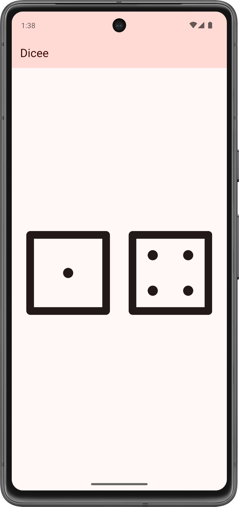

# Dicee 🎲

A Dice Rolling app.

## What I learned

- Flutter stateless widgets to design the user interface.
- Flutter stateful widgets to update the user interface.
- Change the properties of various widgets.
- onPressed listeners to detect when buttons are pressed.
- setState to mark the widget tree as dirty and requiring update on the next render.
- Expanded to make widgets adapt to screen dimensions.
- Understand and use string interpolation.
- Code and use gesture controls.

## In addition

- Material Design 3
- Light/dark mode
- Edge-to-edge mode

